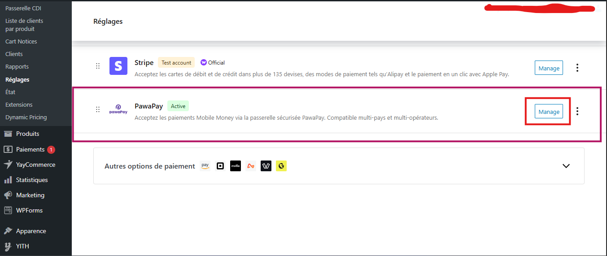

# WooCommerce PawaPay Gateway Plugin

A WordPress payment gateway plugin that integrates **Mobile Money payments** via the **PawaPay API** with automatic currency conversion.  
It supports multi-country, multi-operator payments and ensures secure transaction validation using webhooks and return URLs.

---

## Features

- ✅ Full integration with WooCommerce
- ✅ Mobile Money payments via **PawaPay Payment Page**
- ✅ Automatic currency conversion (any supported currency → XOF / XAF depending on country)
- ✅ Supports both **free** and **API key-based** exchange rate providers
- ✅ Country and operator selection at checkout
- ✅ Mobile operator logos at checkout
- ✅ Multi-country support (West & Central Africa)
- ✅ Sandbox and Production modes
- ✅ Webhook support for secure payment status validation

---

## Supported Countries

The list of supported countries is automatically retrieved from your **PawaPay account**.  
This means that only the countries and operators that are **activated for your merchant account** will appear at checkout.  

You don’t need to manually configure them — the plugin dynamically loads them from PawaPay’s API.

---

## Currency Conversion

The plugin automatically converts from **any store currency** into the supported settlement currencies for PawaPay

### How it works

1. If you configure an **API key** for [ExchangeRate API](https://www.exchangerate-api.com/), the plugin will use the **paid endpoint** for reliable conversion.  
2. If no key is provided, it falls back to the **free endpoint** (less stable, but works without registration).  
3. Conversion rates are cached for **6 hours** to optimize API calls.  

---

## Installation

1. Download the plugin ZIP
   

2. Go to **WordPress Admin → Plugins → Add New**

3. Click **Upload Plugin** and select the ZIP file

4. Activate the plugin  
   

5. Go to **WooCommerce → Settings → Payments**  
   

6. Enable and configure **PawaPay**  
   
   

7. Go to your **Checkout Page** on the site and verify that **PawaPay** is available as a payment method.  
   

---

## Configuration

### Required Settings

1. **API Token** – Your PawaPay API token (from your PawaPay dashboard)  
2. **Environment** – Sandbox (testing) or Production (live transactions)  
3. **Merchant Name** – The name shown on the customer’s statement (max 22 characters)  
4. **ExchangeRate API Key (optional)** – Provide your key for reliable currency conversion. Leave empty to use the free fallback endpoint.  

### Example Configuration in WooCommerce Settings

- API Token: `sk_test_XXXXXX`  
- Environment: `Sandbox`  
- Merchant Name: `MyShop`  
- ExchangeRate API Key: `your_api_key_here` (optional)  

---

## Return URL & Webhooks

- On payment **success or failure**, PawaPay redirects the customer to your store using the `returnUrl`.  
- The plugin also supports **PawaPay webhooks**, ensuring that the order status in WooCommerce always matches the real payment status.  

This means your customers **cannot bypass failed transactions**, as the order is updated directly from PawaPay.

### Webhook Configuration

To ensure your WooCommerce order statuses are updated securely and automatically, you need to configure a **Webhook URL** in your PawaPay dashboard.

### Webhook URL

    https://your-domaine.com/wp-json/pawapay/v1/deposit-callback

### Important Notes

- If the **webhook is not configured**, the payment status will only update when the customer clicks **"Return to Store"** after completing the payment.
- With the webhook properly configured, WooCommerce will always reflect the **real payment status** (success, failure, pending).
- Make sure your domain is publicly accessible and uses **HTTPS**.
- Test first in **Sandbox Mode** before going live.

---

## Hooks & Filters

### Actions

- `pawapay_before_payment_processing` – Before payment is created
- `pawapay_after_payment_processing` – After payment is created
- `pawapay_payment_success` – When a payment succeeds
- `pawapay_payment_failed` – When a payment fails

### Filters

- `pawapay_supported_countries` – Modify supported countries
- `pawapay_supported_currencies` – Modify supported currencies
- `pawapay_provider_list` – Modify mobile operators
- `pawapay_payment_description` – Customize payment description

---

## Troubleshooting

### Gateway not showing at checkout

- Verify WooCommerce is active  
- Ensure your store currency is supported  
- Confirm the API token is configured  

### Currency conversion errors

- If using the free endpoint, it may be unavailable at times  
- Add an **ExchangeRate API key** for reliable conversion  

### Issues with WooCommerce Blocks

- Update to the latest WooCommerce version  
- Clear your site cache  

---

## Roadmap

- [ ] Advanced transaction management dashboard

---

## Support

1. Check [PawaPay Documentation](https://docs.pawapay.io/v2/docs)  
2. Open an issue on the GitHub repository  
3. Contact [Kabirou ALASSANE](https://kabiroualassane.link)

---

## License

This plugin is licensed under the GNU General Public License v3.0 (GPLv3) or later.  
You can redistribute it and/or modify it under the terms of the GPL as published by the Free Software Foundation.

---

## Contributors

- Developed & maintained by [Kabirou ALASSANE](https://kabiroualassane.link)  

---

**Note**: This plugin requires a valid **PawaPay API key** to process payments. Sign up at [PawaPay](https://pawapay.io) to get your credentials.  
