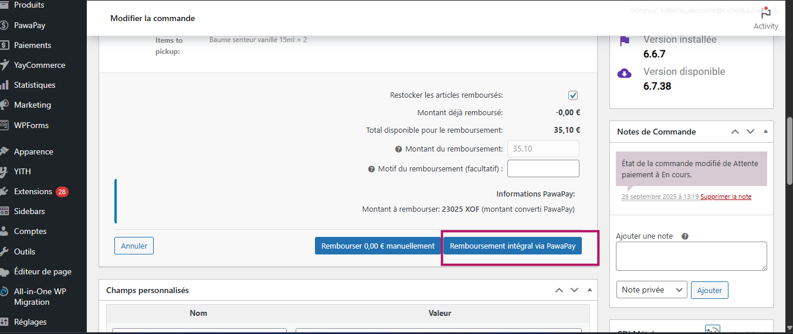

# WooCommerce PawaPay Gateway Plugin

A WordPress payment gateway plugin that integrates **Mobile Money payments** via the **PawaPay API** with automatic currency conversion.  
It supports multi-country, multi-operator payments, secure transaction validation via webhooks and return URLs, and provides full support for both **WooCommerce Classic Checkout** and **Block Checkout**.

---

## Features

✅ Full integration with WooCommerce  
✅ Mobile Money payments via the **PawaPay Payment Page**  
✅ Automatic currency conversion (any supported currency → XOF / XAF depending on country)  
✅ Supports both free and API-key-based exchange rate providers  
✅ Country and operator selection at checkout  
✅ Mobile operator logos displayed at checkout  
✅ Multi-country support (West & Central Africa)  
✅ Sandbox and Production modes  
✅ Secure webhook support for real-time status validation
✅ Supports both **Block Checkout** and **Classic Checkout** interfaces  
✅ Admin **PawaPay Dashboard** with transaction history and refund management
✅ Email Notifications
✅ Complete refund system:

- Refunds directly from WooCommerce order details  
- Dedicated refund interface in the **PawaPay Dashboard**  
- Refund history tracking

---

## Supported Countries

The list of supported countries and operators is automatically retrieved from your **PawaPay merchant account**.  
Only countries and operators that are **enabled** for your account will appear at checkout.  

You don’t need to manually configure them — the plugin dynamically loads this data from PawaPay’s API.

---

## Currency Conversion

The plugin automatically converts any store currency into one of the settlement currencies supported by PawaPay (XOF / XAF).

### How it works

1. If you configure an **ExchangeRate API key**, the plugin uses the **premium endpoint** for accurate and reliable conversion.  
2. If no key is provided, it falls back to the **free endpoint** (less reliable but works without registration).  
3. Exchange rates are cached for **6 hours** to reduce API requests.

---

## Installation

1. Download the plugin ZIP

   
2. Go to **WordPress Admin → Plugins → Add New**
3. Click **Upload Plugin** and select the ZIP file

   
4. Activate the plugin

   
   
5. Go to **WooCommerce → Settings → Payments**

   
6. Enable and configure **PawaPay**

   
   
7. Visit your **Checkout Page** (Block or Classic) and confirm that PawaPay appears as a payment method.

---

## Configuration

### Required Settings

| Setting | Description |
|----------|-------------|
| **Title** | The payment method name displayed at checkout (e.g., *Mobile Money (PawaPay)*) |
| **Description** | The message displayed under the payment method during checkout |
| **API Token** | Your PawaPay API token (available in your PawaPay dashboard) |
| **Environment** | Choose between **Sandbox** (test mode) and **Production** (live mode) |
| **Webhook Identifier** | A unique value that identifies your store. This is used in the payment metadata to distinguish webhooks when multiple stores share the same PawaPay account. |
| **Payment Page Language** | Select the language used on the PawaPay payment page (**English** or **French**) |
| **ExchangeRate API Key (optional)** | Enter your ExchangeRate API key for reliable currency conversion. Leave empty to use the free fallback endpoint. |

### Example Configuration

- **Title**: Mobile Money (PawaPay)  
- **Description**: You will be redirected to a secure page to complete your payment.  
- **API Token**: sk_test_XXXXXX  
- **Environment**: Sandbox  
- **Webhook Identifier**: myshop-unique-id  
- **Payment Page Language**: ENGLISH  
- **ExchangeRate API Key**: your_api_key_here (optional)

---

## Return URLs & Webhooks

On payment success or failure, PawaPay redirects the customer back to your store using the configured `returnUrl`.  
The plugin also supports **PawaPay webhooks**, ensuring that WooCommerce order statuses always match the actual payment state.

### Webhook Configuration

In your PawaPay dashboard, configure the following URLs:

**Payment Webhook URL:**
<https://your-domain.com/wp-json/pawapay/v1/deposit-callback>

**Refund Webhook URL:**
<https://your-domain.com/wp-json/pawapay/v1/refund-callback>

### Notes

- If the webhook is not configured, the payment status will only update when the customer clicks “Return to Store.”  
- When configured correctly, WooCommerce will automatically reflect real payment states (**Success**, **Failed**, **Pending**).  
- Ensure your domain is **HTTPS** and publicly accessible.  
- Always test in **Sandbox Mode** before going live.  

---

## Email Notifications

The plugin automatically sends email notifications related to payment and refund events — both to the customer and the store admin, provided that email notifications are enabled in WooCommerce → Settings → Emails.

Supported Email Events

- Payment Success

  - Customer receives a confirmation email for successful payment.

  - Admin receives a notification email with full payment details.

- Payment Failed

  - Customer receives an email notifying them that their payment attempt failed.

  - Admin is alerted with the failed transaction details.

- Refund Success

  - Customer receives an email confirming that their payment has been refunded.

  - Admin is notified with refund details and reference ID.

- Refund Failed

  - Admin receives an email when a refund attempt fails (with reason and response message).

### Requirements

WooCommerce email notifications must be enabled (WooCommerce → Settings → Emails)

Ensure that the From email address and email templates are correctly configured

SMTP or transactional email service (like WP Mail SMTP, SendGrid, or Brevo) is recommended for better deliverability

---

## Refund System

You can process refunds using two different methods:

### 1. From WooCommerce Order Details

- Go to **WooCommerce → Orders**  
- Open an order paid with PawaPay  
- Click **Refund** inside the order details  
- The plugin automatically sends the refund request to PawaPay via API
  

### 2. From the PawaPay Dashboard

- Go to **PawaPay → Refunds** in the WordPress admin menu  
- Use the dedicated refund interface to process refunds  
- Select the order, specify the amount and reason, and confirm  
- A complete refund history is stored for your reference  
  

### Refund Features

✅ Full and partial refunds  
✅ Automatic synchronization with PawaPay API  
✅ Automatic WooCommerce order status updates  
✅ Detailed refund history and logs  
✅ Automatic order notes with refund details  

---

## Admin Dashboard

The plugin adds a **PawaPay** section to the WordPress admin sidebar.

### Menu Sections

- **Dashboard** – Overview of recent transactions and order statistics  
- **Transactions** – Complete list of all PawaPay payments  
- **Refunds** – Dedicated refund interface and refund history  

### Available Statistics

- Total orders  
- Paid orders  
- Pending orders  
- Total revenue  

---

## WooCommerce Blocks Support

### Full Compatibility

The plugin fully supports the **new WooCommerce Block Checkout** experience:

- Seamless integration into the payment block  
- Responsive and user-friendly interface  
- Real-time validation  
- Works with all modern block-based themes  
- Dynamic currency conversion support  

### Classic Checkout

The plugin also works perfectly with the **Classic Checkout** interface used in traditional WooCommerce setups.

---

## Hooks & Filters

### Actions

- `pawapay_before_payment_processing` – Before creating a payment  
- `pawapay_after_payment_processing` – After creating a payment  
- `pawapay_payment_success` – When a payment succeeds  
- `pawapay_payment_failed` – When a payment fails  

### Filters

- `pawapay_supported_countries` – Modify supported countries  
- `pawapay_supported_currencies` – Modify supported currencies  
- `pawapay_provider_list` – Modify mobile operator list  
- `pawapay_payment_description` – Customize payment description  

---

## Troubleshooting

### Gateway not visible at checkout

- Ensure WooCommerce is active  
- Check that your store currency is supported  
- Verify that your PawaPay API token is valid  

### Currency conversion errors

- The free endpoint may be unreliable — use an API key for better stability  

### WooCommerce Block Checkout issues

- Update WooCommerce and WooCommerce Blocks to the latest version  
- Clear your website cache  

---

## Roadmap

- [ ] Advanced analytics and transaction dashboard  
- [ ] Support Payout

---

## Support

1. Check [PawaPay Documentation](https://docs.pawapay.io/v2/docs)  
2. Open an issue on the GitHub repository  
3. Contact [Kabirou ALASSANE](https://kabiroualassane.link)

---

## License

This plugin is licensed under the **GNU General Public License v3.0 (GPLv3)** or later.  
You can redistribute and/or modify it under the terms of the GPL as published by the Free Software Foundation.

---

## Contributors

- Developed & maintained by [Kabirou ALASSANE](https://kabiroualassane.link)

---

**Note:**  
This plugin requires a valid **PawaPay API key** to process payments.  
Sign up at [PawaPay](https://pawapay.io) to get your credentials.
