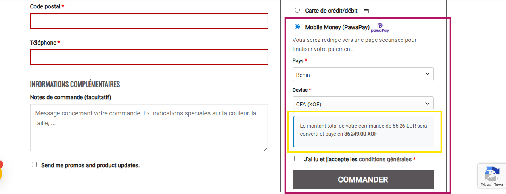

# WooCommerce PawaPay Gateway Plugin

A WordPress payment gateway plugin that integrates **Mobile Money payments** via the **PawaPay API** with automatic currency conversion.  
It supports multi-country, multi-operator payments and ensures secure transaction validation using webhooks and return URLs.

---

## Liens Utiles

- **GitHub Repository**: [wc-pawapay-gateway-plugin](https://github.com/BlakvGhost/wc-pawapay-gateway-plugin)
- **Contact / Support**: [Kabirou ALASSANE](https://kabiroualassane.link)  
- **X**: [@BlakvGhost](https://x.com/BlakvGhost)  

---

## Features

- ✅ Full integration with WooCommerce
- ✅ Mobile Money payments via **PawaPay Payment Page**
- ✅ Automatic currency conversion (any supported currency → XOF / XAF depending on country)
- ✅ Supports both **free** and **API key-based** exchange rate providers
- ✅ Country and operator selection at checkout
- ✅ Mobile operator logos at checkout
- ✅ Multi-country support (West & Central Africa)
- ✅ Sandbox and Production modes
- ✅ Webhook support for secure payment status validation

---

## Supported Countries

The list of supported countries is automatically retrieved from your **PawaPay account**.  
This means that only the countries and operators that are **activated for your merchant account** will appear at checkout.  

You don’t need to manually configure them — the plugin dynamically loads them from PawaPay’s API.

---

## Currency Conversion

The plugin automatically converts from **any store currency** into the supported settlement currencies for PawaPay.

**How it works**

1. Configure an **API key** for [ExchangeRate API](https://www.exchangerate-api.com/) → plugin uses the **paid endpoint**.  
2. If no key → fallback to **free endpoint**.  
3. Conversion rates are cached for **6 hours**.

---

## Installation

1. Download the plugin ZIP
   

2. Go to **WordPress Admin → Plugins → Add New**

3. Click **Upload Plugin** and select the ZIP file

4. Activate the plugin  
   

5. Go to **WooCommerce → Settings → Payments**  
   

6. Enable and configure **PawaPay**  
   
   

7. Go to your **Checkout Page** on the site and verify that **PawaPay** is available as a payment method.
   

---

## Configuration

### Required Settings

- **API Token** – Your PawaPay API token  
- **Environment** – Sandbox or Production
- **ExchangeRate API Key (optional)** – For reliable currency conversion

---

## Return URL & Webhooks

- PawaPay redirects customers on success/failure  
- Webhooks update WooCommerce order status automatically

### Webhook Configuration

To ensure your WooCommerce order statuses are updated securely and automatically, you need to configure a **Webhook URL** in your PawaPay dashboard.

### Webhook URL

    https://your-domaine.com/wp-json/pawapay/v1/deposit-callback

### Important Notes

- If the **webhook is not configured**, the payment status will only update when the customer clicks **"Return to Store"** after completing the payment.
- With the webhook properly configured, WooCommerce will always reflect the **real payment status** (success, failure, pending).
- Make sure your domain is publicly accessible and uses **HTTPS**.
- Test first in **Sandbox Mode** before going live.

---

## Hooks & Filters

**Actions**  

- `pawapay_before_payment_processing` – Before payment  
- `pawapay_after_payment_processing` – After payment  
- `pawapay_payment_success` – On success  
- `pawapay_payment_failed` – On failure  

**Filters**  

- `pawapay_supported_countries` – Modify supported countries  
- `pawapay_supported_currencies` – Modify supported currencies  
- `pawapay_provider_list` – Modify mobile operators  
- `pawapay_payment_description` – Customize description  

---

## Troubleshooting

**Gateway not showing**: Check WooCommerce active, store currency supported, API token configured  
**Currency errors**: Free endpoint may fail → add ExchangeRate API key  
**WooCommerce Blocks issues**: Update WooCommerce & clear cache  

---

## Roadmap

- [ ] Advanced transaction dashboard  
- [ ] Reports & analytics

---

## Support

- [PawaPay Docs](https://docs.pawapay.io/v2/docs)  
- Open a [GitHub issue](https://github.com/BlakvGhost/wc-pawapay-gateway-plugin/issues)  
- Contact [Kabirou ALASSANE](https://kabiroualassane.link)

---

## License

GPLv3

---

## Contributors

- [Kabirou ALASSANE](https://kabiroualassane.link)  

---

**Note**: Requires valid PawaPay API key. Sign up at [PawaPay](https://pawapay.io).
